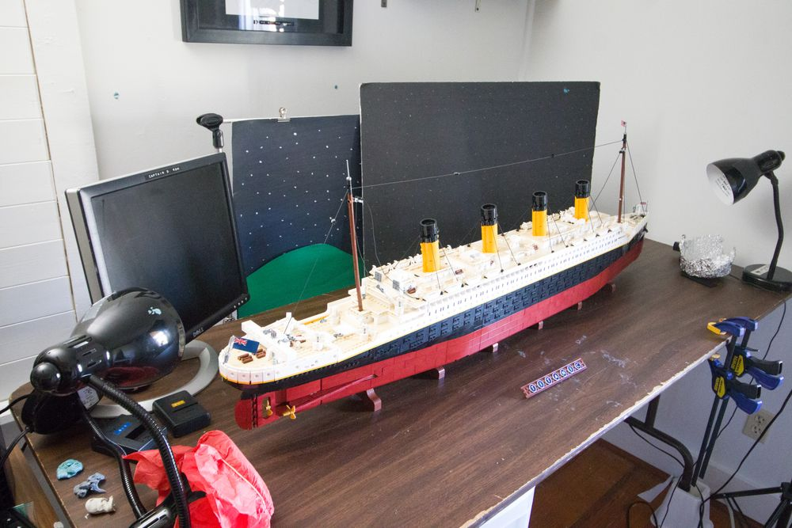

*Made exclusively with parts from LEGO Titanic (10294).*

Upon receiving an email by the LEGO Ambassador Network who graciously provided this set for review, I never expected to receive a set as massive as the LEGO Titanic turned out to be.

With a part count of 9090 pieces and a total length of 4.5 feet, as well as a price tag to match, the LEGO Titanic was an experience to put together and animate. The whole build took a handful of full days building, stretched out over a few weeks. If I wasn't on a tight deadline to build it to review, I probably would have spent months casually building this ship.

Even with the box being as large and heavy as it was, I didn't anticipate the ship to take up so much actual space in my studio. I can't even display this in my house, because I don't have a surface long enough!

Just animating it took my entire 6 foot table when I needed to show the whole ship in a shot.

Despite the challenge of fitting the ship into my space, building it and animating it was rather enjoyable. I found lots of little details on the ship to focus on in the film, and it was a fun challenge to work with the heavy model to make it seem like it was sinking.

I still can't help but wonder who the target audience for this set is. There are quite a few prerequisites before buying this! The price tag is the first hurdle, then you need enough time to build the extremely tedious details in the ship, then you need enough space to display it! I'm sure someone can meet all those requirements, but as for me, I'll have to wait a few years to display this, because I need my animation desk for another project real soon! ;)

If you're interested in more Behind the Scenes of the brickfilm I made with the Titanic, be sure to check out my YouTube #shorts video for a quick look into the production of this film.

<iframe width="800" height="500" src="https://www.youtube.com/embed/L9-pCk-vlFc" title="YouTube video player" frameborder="0" allow="accelerometer; autoplay; clipboard-write; encrypted-media; gyroscope; picture-in-picture" allowfullscreen></iframe>

Special thanks to the LEGO Ambassador Network for providing this set for review.

Voice Actors:

- [Mark Nelson](https://www.youtube.com/channel/UCI1NkDHY187f1ontRjWtRlQ)

- [Hudson Ludy](https://www.youtube.com/c/Spudson)

- [Rioforce](https://www.youtube.com/rioforce)

- [Natalie Zwolanek](https://www.youtube.com/user/starwarsstudio100)

- [Squidtastic](https://www.youtube.com/channel/UC1XHGQ4P5iT2OhwEIdDewLg)

-rioforce
